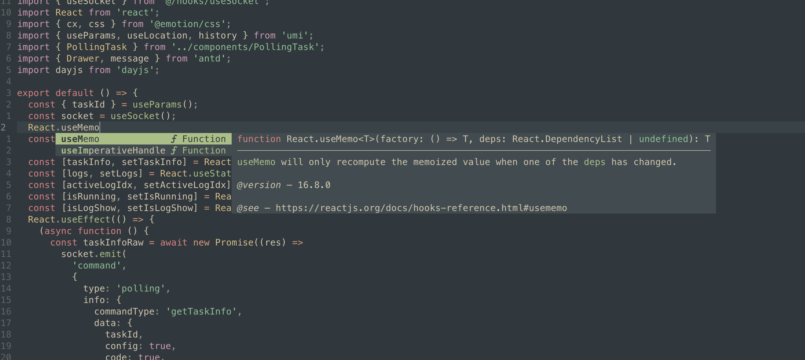

## Basic Neovim Config for Typescript(Javascript)

> This config used for sever side nvim config. Try to keep same with self vscode config.

## Install

### Pre
Install this first
  - [ neovim(v0.7+) ](https://neovim.io/)
  - [ packer ](https://github.com/wbthomason/packer.nvim)
  - [ lsp for ts](https://github.com/typescript-language-server/typescript-language-server)
  - riggrep

```bash
git clone --depth 1 https://github.com/ncqwer/nvim-config.git ~/.config/nvim
```

## ScreenShot



